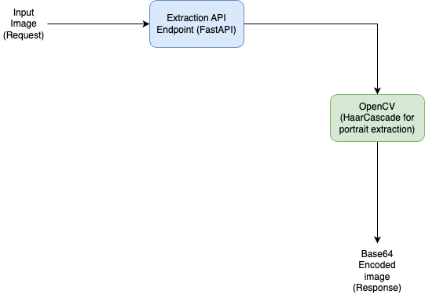

### Extraction API (Allows extraction of potrait from given image)
This API allows users to upload an image and extract a portrait photo (e.g., from an ID card or passport). The extracted portrait is returned as a base64-encoded image. The API is built using FastAPI and containerized with Docker.

#### Prerequisites
- Python 3.9+
- Docker (for containerized version)

### Installation
- Clone the respository using
``` git clone https://github.com/talhajamil05/potrait-extraction```
- Navigate to the root project directory
```cd portrait-extraction```
-  Create and Activate Python Virtual Environment
```python3 -m venv venv```
```source venv/bin/activate```
- Install Dependencies
```pip install -r requirements.txt```
- Run the API:
```uvicorn src.main:app --reload```
- The API will be accessible at http://localhost:8000
- The swagger docs for testing can be accessed at http://localhost:8000/docs

API Endpoints
1. Health Check
***Endpoint:*** /healthcheck
***Method***: GET
***Description:*** Health Check endpoint to check the status of API

2. Extract Portrait
***Endpoint:*** /extract
***Method:*** POST
***Description:*** Accepts an uploaded image file, detects a portrait in the image, and returns it as a base64-encoded string. If no face is detected, it returns an error message.
***Response Body:***
{
  "image": "<base64_encoded_string>"
}

### Docker Instructions
To run the containerized version:
- Navigate to the root directory and build the Docker Image:
```docker build -t portrait-extractor . ```
- Run the Docker Container:
```docker run -p 8000:8000 portrait-extractor```
- The API will be accessible at http://0.0.0.0:8000

### Architecture and Flow
- 
